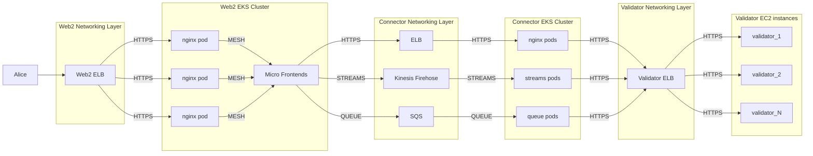

## SN Owners' to do list 

- Fork the template and put up a PR to create a React app that works for respective SN: add @specialK111 as reviewer. Set up a walkthrough session with @specialK111
  
- SLA

- Product proposal & existing URL/frontend
  

## Web 2 and Connector Architecture

It's not clear to me if the Micro Frontends (MFE) need to be fluent in non https talk. 

The reason being not all AI models are the same. Some are stream based, some could be queue based, and some are prompt/response interactive.

