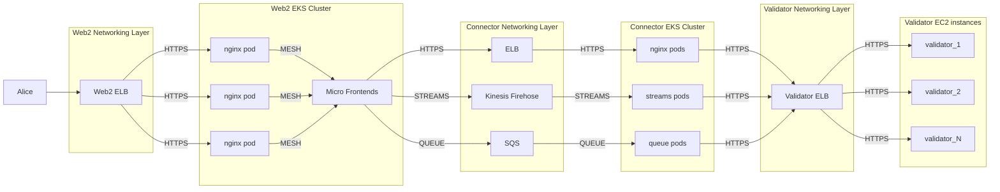

# Connector Documentation Guidelines

## TLDR / Subnet Owner's Todo List
- Fork the repo and put up a PR to add OpenAPI documentation for your respective SNs API connector under the `SN_[YOUR_SUBNET_NUMBER_HERE]` directory, add @specialk111 as reviewer
- Set up a walkthrough session with @specialk111
- SLA
- Product proposal & existing URL/frontend

## Introduction
To ensure uniformity and to facilitate easier integration, we request all subnets who are collaborating with us to follow a set format for API documentation. This README outlines the requirements for submitting connector API documentation.

## Documentation Format
All API documentation should be provided in the [OpenAPI specification](https://github.com/OAI/OpenAPI-Specification/blob/main/versions/3.1.0.md), using either YAML or JSON formats. We recommend using the `Library API` documentation (located in the `SN_X` folder) as a template or reference for how your API documentation should be structured.

## Required Information
Your API documentation should include the following key elements:

### API Details
- Base URL: The root URL of your API where all endpoint paths will be appended.
- Authentication: Details on the authentication mechanism (e.g., API keys, OAuth tokens).
- Rate Limits: Information on any limitations on the number of API calls.

### Endpoints
For each public endpoint in your API, the documentation must include:

- Path: The specific URL path for the endpoint.
- Method: The HTTP method (GET, POST, PUT, DELETE, etc.) used.
- Parameters: Any parameters required or optional, their data types, and whether they are included in the query string, path, or body.
- Request Examples: Example requests to show how data should be formatted and sent.
- Response Examples: Example responses from the API including error responses and status codes.
- Data Types: Clearly specify the data types that are expected by and returned from the API.

### Data Types
Specify the data structures used in your API. For each data type, detail:

- Properties: Name and data type of each property.
- Required: Fields that are mandatory.
- Example Values: Provide examples of what the data type should look like.

## Non-RESTful APIs
If connecting to your system does not involve RESTful API endpoints but uses other methods (like WebSocket connections, FTP, etc.), please provide detailed documentation in any format that includes:

- Connection Details: How to establish a connection from the frontend.
- Data Transmission: How data is sent and received through your system.
- Examples and Use Cases: Detailed examples of using your system including any initialization or setup needed.

## Submission
Please fork this repo and submit a pull request with your subnet's complete connector documentation. Following the `SN_X` example, create a directory for your subnet (`SN_[YOUR_SUBNET_NUMBER_HERE]`) and add your connector details.

## Web 2 and Connector Architecture

